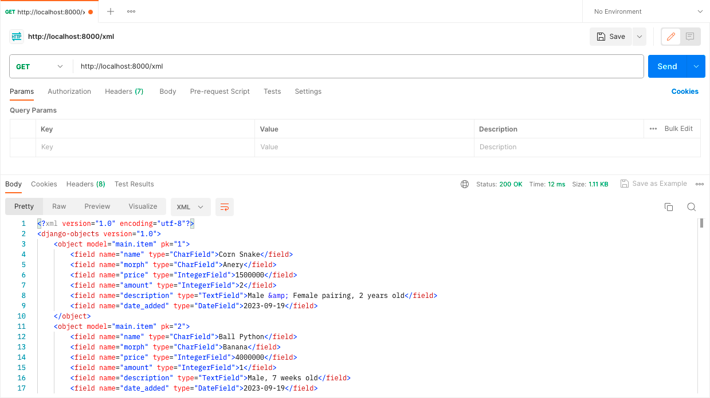

# snakeInventory
Link Adaptable: https://serpentshaven.adaptable.app/main/

Tugas 2
1. Jelaskan bagaimana cara kamu mengimplementasikan checklist di atas secara step-by-step (bukan hanya sekadar mengikuti tutorial).

2. Buatlah bagan yang berisi request client ke web aplikasi berbasis Django beserta responnya dan jelaskan pada bagan tersebut kaitan antara urls.py,
   views.py, models.py, dan berkas html.
    HTTP request -->  urls.py
                        |
                        v
models.py   <-- -->  views.py --> HTTP response
                        ʌ
                        |
                   templates.py
    
    Setelah client melakukan HTTP request kepada URL, akan dicari pattern yang sesuai pada urls.py lalu akan dipanggil fungsi atau class pada
    views.py yang sesuai. Jika ada data yang dibutuhkan, proses akan dilanjut ke models.py yang menyediakan data tersebut. Setelah itu akan
    dikembalikan kepada views.py yang akan memberikan HTTP response yang mengandung berkas HTML kembali kepada client.

3. Jelaskan mengapa kita menggunakan virtual environment? Apakah kita tetap dapat membuat aplikasi web berbasis Django
   tanpa menggunakan virtual environment?
   Virtual environment digunakan untuk meng-install package dan library yang dibutuhkan untuk suatu projek tanpa memengaruhi projek lain. Misal,
   jika pada projek 1, dibutuhkan package A versi 1, namun pada projek 2 dibutuhkan package A versi 2, dengan menggunakan virtual environment, hal
   tersebut bisa dilakukan sehingga tidak terjadi conflict. Jika virtual environment tidak digunakan saat membuat suatu projek, semua package dan
   library akan digunakan secara global. Walau tidak menggunakan virtual environment bisa dilakukan, hal tersebut tidak dianjurkan agar bisa
   menghindari conflict yang mungkin terjadi.

4. Jelaskan apakah itu MVC, MVT, MVVM dan perbedaan dari ketiganya.
    MVC. MVT, dan MVVM merupakan pola arsitektur yang digunakan pada pengembangan perangkat lunak yang mengimplementasikan separation of concern,
    yaitu konsep dimana komponen yang berkaitan akan dijadikan suatu kesatuan dan dipisah dari kelompok komponen lainnya.
    
    MVC merupakan singkatan dari Model, View, Controller.
    Model bertugas untuk mengelola data pada database dan me-respond kepada request user.
    View bertugas untuk menangkap input dan menampilkan data tersebut kepada user.
    Controller bertugas untuk menghubungkan Model dan View. Controller menerima input dari View, memberikan nya ke Model, lalu mengganti View
    sesuai input tersebut.

    MVT merupakan singkatan dari Model, View, Template.
    Model pada MVT memiliki tugas yang mirip dengan Model pada MVC, yaitu untuk mengelola data.
    View bertanggung jawab untuk menerima web request dan memberikan response yang sesuai.
    Template bertugas untuk menampilkan data yang diterima dari View.

    MVVM merupakan singkatan dari Model, View, ViewModel.
    Model pada MVVM memiliki tugas yang mirip dengan Model pada MVC dan MVT, yaitu untuk mengelola data.
    View pada MVVM juga memiliki tugas yang mirip dengan View pada MVC dan MVT, yaitu berhubungan dengan User Interface.
    ViewModel bertugas untuk menghubungkan Model dan View dengan menerima data dari Model dan memberikannya ke View.

    Salah satu perbedaan dari MVC, MVT, dan MVVM adalah interaksi View nya. Pada MVC, View berhubungan dengan Controller untuk mengirimkan input
    user serta me-request update dari Model. Pada MVT, View menggunakan View functions untuk mengakses Model dan me-return HTTP response. Dan pada
    MVVM, View berinteraksi dengan ViewModel yang akan menghubungkan dengan Model.

Tugas 3
1. Apa perbedaan antara form POST dan form GET dalam Django?
   POST dan GET merupakan method HTTP request. POST digunakan untuk mengirim data ke server untuk mengganti isi database. Sedangkan GET digunakan untuk mengambil data dari server dan tidak mengganti isi dari database. Pada request POST, data dikirimkan melalui request body sehingga membuat request POST lebih aman untuk mengirimkan data dibanding GET yang datanya akan tertulis dalam URL. POST biasanya digunakan untuk mengisi data diri karena data tersebut bersifat pribadi, sedangkan GET biasanya digunakan untuk mencari suatu hal pada search bar karena bersifat umum.

2. Apa perbedaan utama antara XML, JSON, dan HTML dalam konteks pengiriman data?
   Hypertext Markup Language (HTML) digunakan untuk menampilkan teks, gambar, dan multimedia lainnya seperti audio, video, dll. eXtensible Markup Language (XML) dan JavaScript Object Notation (JSON) dapat dipertukarkan, namun XML menyimpan data dengan menggunakan tag dalam struktur tree sedangkan JSON menggunakan key-value pairs seperti dictionary. Maka dari itu, HTML lebih fokus kepada penampilan suatu website, sedangkan XML dan JSON lebih fokus pada pengaturan struktur data

3. Mengapa JSON sering digunakan dalam pertukaran data antara aplikasi web modern?
   JSON sering digunakan karena kemudahan pengaturan dan pembacaan data oleh manusia dan komputer. JSON juga mudah diimplementasikan pada bermacam bahasa pemrograman.

4. Jelaskan bagaimana cara kamu mengimplementasikan checklist di atas secara step-by-step (bukan hanya sekadar mengikuti
   tutorial).
   1. Membuat input form untuk menambahkan objek model pada app sebelumnya.
      Membuat file forms.py yang mengimport class Item dari models.py sehingga nanti akan bisa menginput nilai name, morph, price, amount, dan description pada form dalam website. Selanjutnya, pada views.py, akan ditambahkan function baru (create_item) untuk menerima POST request agar setelah form nya terisi, view nya akan ke redirect ke main.html dengan tambahan item (beserta atribut yang dapat ditambahkan) pada tabel. Pada function show_main, semua objek yang ada di Item, akan disimpan di variabel items, yang disimpan pada string 'items' agar bisa dipanggil dalam main.html. Kemudian, akan ditambahkan URL path pada urlpatterns untuk create_item dalam urls.py (di dalam main) supaya forms nya dapat dibuka pada halaman baru website. Di file create_item.html, terdapat kode untuk penampilan halaman forms.
      <form method="POST">...</form> --> agar data yang terisi pada form terkirim menggunakan method POST
       --> Cross-Site Request Forgery (CSRF), untuk memastikan bahwa yang mensubmisi form nya berwenang untuk melakukan hal tersebut, dan mencegah pemalsuan data
      form.as_table --> membuat form dalam tabel, kolom pertama akan berisi judul atribut (seperti name, morph, price, amount, dan description), dan kolom kedua akan menerima input dari user untuk setiap atribut yang ada.
      Terakhir, menambahkan button pada main.html untuk mendirect ke halaman forms (create_item.html).

   2. Tambahkan 5 fungsi views untuk melihat objek yang sudah ditambahkan dalam format HTML, XML, JSON, XML by ID, dan
      JSON by ID.
      Pertama akan di import class HttpResponse dari django.http dan modul serializers dari django.core pada views.py. HttpResponse akan mengizinkan kita untuk mengirim data yang sesuai dengan permintaan client. Sedangkan serializers berguna untuk mengganti format data yang ada ke dalam bentuk HTML, XML atau JSON.
      Untuk format HTML, akan ditambahkan function show_main pada views.py, dimana semua objek yang ada di Item, akan disimpan di variabel items, yang disimpan pada string 'items' agar bisa dipanggil dalam main.html. (Pembuatan fungsi create_item sudah dibahas pada poin 1).
      Lalu akan dibuat fungsi show_xml dan show_json pada views.py dengan cara mengambil semua objek pada class Item dan mengubahnya menggunakan serializers menjadi XML dan JSON sesuai dengan nama fungsinya. Setelah itu, data dalam bentuk XML atau JSON tersebut akan dikembalikan sebagai HTTP response menggunakan class HttpResponse.
      Terdapat juga fungsi show_xml_by_id dan show_json_by_id dimana HTTP response hanya akan berisi Item yang sesuai dengan id yang diberikan. Pada fungsi-fungsi tersebut, terdapat 'filter(pk=id)' pada bagian akhir barisan kode pertama yang bertujuan untuk mengecek jika ada instance Item yang memiliki primary key (pk) yang sesuai dengan id yang diberikan.

   3. Membuat routing URL untuk masing-masing views yang telah ditambahkan pada poin 2.
      Untuk membuat routing URL, pada urls.py, akan di import fungsi-fungsi yang telah dibuat dari main.views. Lalu, akan ditambahkan path pada urlpatterns yang akan berisi pattern pada url, fungsi pada view, dan nama nya.

Tugas 4
Username 1: Sabina
Password 1: Kucing<33

Username 2:
Password 2:

1. Apa itu Django UserCreationForm, dan jelaskan apa kelebihan dan kekurangannya?
   

2. Apa perbedaan antara autentikasi dan otorisasi dalam konteks Django, dan mengapa keduanya penting?
   

3. Apa itu cookies dalam konteks aplikasi web, dan bagaimana Django menggunakan cookies untuk mengelola data sesi
   pengguna?
   

4. Apakah penggunaan cookies aman secara default dalam pengembangan web, atau apakah ada risiko potensial yang harus
   diwaspadai?

5. Jelaskan bagaimana cara kamu mengimplementasikan checklist di atas secara step-by-step (bukan hanya sekadar mengikuti
   tutorial).

