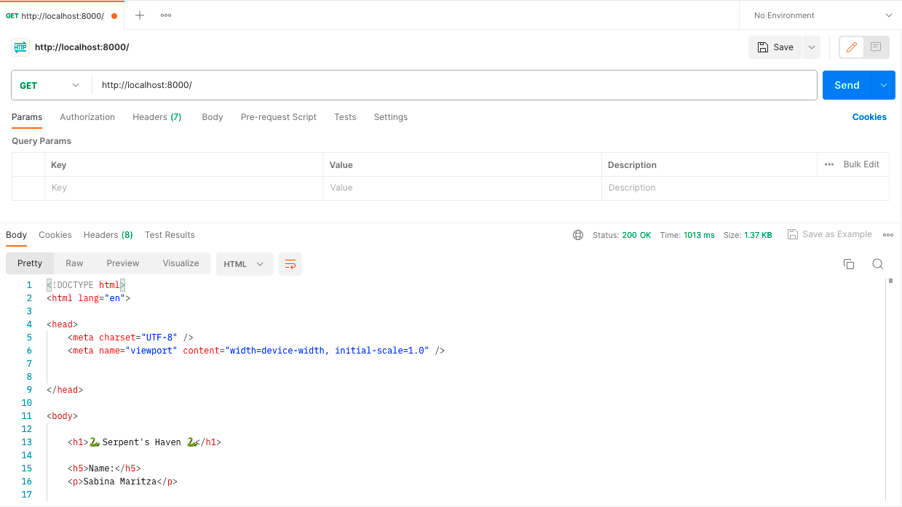
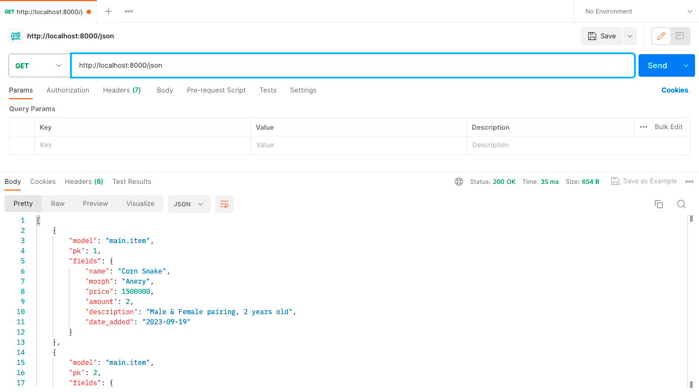

# snakeInventory
Link Adaptable: https://serpentshaven.adaptable.app/main/

   
 Tugas 2 

   
   1. Jelaskan bagaimana cara kamu mengimplementasikan checklist di atas secara step-by-step (bukan hanya sekadar mengikuti tutorial).

   2. Buatlah bagan yang berisi request client ke web aplikasi berbasis Django beserta responnya dan jelaskan pada bagan tersebut kaitan antara urls.py,
   views.py, models.py, dan berkas html.
      HTTP request -->  urls.py
                           |
                           v
   models.py   <-- -->  views.py --> HTTP response
                           ʌ
                           |
                      templates.py
    
    Setelah client melakukan HTTP request kepada URL, akan dicari pattern yang sesuai pada urls.py lalu akan dipanggil fungsi atau class pada
    views.py yang sesuai. Jika ada data yang dibutuhkan, proses akan dilanjut ke models.py yang menyediakan data tersebut. Setelah itu akan
    dikembalikan kepada views.py yang akan memberikan HTTP response yang mengandung berkas HTML kembali kepada client.

   3. Jelaskan mengapa kita menggunakan virtual environment? Apakah kita tetap dapat membuat aplikasi web berbasis Django
   tanpa menggunakan virtual environment?
      Virtual environment digunakan untuk meng-install package dan library yang dibutuhkan untuk suatu projek tanpa memengaruhi projek lain. Misal, jika pada projek 1, dibutuhkan package A versi 1, namun pada projek 2 dibutuhkan package A versi 2, dengan menggunakan virtual environment, hal tersebut bisa dilakukan sehingga tidak terjadi conflict. Jika virtual environment tidak digunakan saat membuat suatu projek, semua package dan library akan digunakan secara global. Walau tidak menggunakan virtual environment bisa dilakukan, hal tersebut tidak dianjurkan agar bisa menghindari conflict yang mungkin terjadi.

   4. Jelaskan apakah itu MVC, MVT, MVVM dan perbedaan dari ketiganya.
      MVC. MVT, dan MVVM merupakan pola arsitektur yang digunakan pada pengembangan perangkat lunak yang mengimplementasikan separation of concern, yaitu konsep dimana komponen yang berkaitan akan dijadikan suatu kesatuan dan dipisah dari kelompok komponen lainnya.
    
      MVC merupakan singkatan dari Model, View, Controller.
      Model bertugas untuk mengelola data pada database dan me-respond kepada request user.
      View bertugas untuk menangkap input dan menampilkan data tersebut kepada user.
      Controller bertugas untuk menghubungkan Model dan View. Controller menerima input dari View, memberikan nya ke Model, lalu mengganti View
      sesuai input tersebut.

      MVT merupakan singkatan dari Model, View, Template.
      Model pada MVT memiliki tugas yang mirip dengan Model pada MVC, yaitu untuk mengelola data.
      View bertanggung jawab untuk menerima web request dan memberikan response yang sesuai.
      Template bertugas untuk menampilkan data yang diterima dari View.

      MVVM merupakan singkatan dari Model, View, ViewModel.
      Model pada MVVM memiliki tugas yang mirip dengan Model pada MVC dan MVT, yaitu untuk mengelola data.
      View pada MVVM juga memiliki tugas yang mirip dengan View pada MVC dan MVT, yaitu berhubungan dengan User Interface.
      ViewModel bertugas untuk menghubungkan Model dan View dengan menerima data dari Model dan memberikannya ke View.

      Salah satu perbedaan dari MVC, MVT, dan MVVM adalah interaksi View nya. Pada MVC, View berhubungan dengan Controller untuk mengirimkan input user serta me-request update dari Model. Pada MVT, View menggunakan View functions untuk mengakses Model dan me-return HTTP response. Dan pada MVVM, View berinteraksi dengan ViewModel yang akan menghubungkan dengan Model.

   
Tugas 3

   1. Apa perbedaan antara form POST dan form GET dalam Django?
      POST dan GET merupakan method HTTP request. POST digunakan untuk mengirim data ke server untuk mengganti isi database. Sedangkan GET digunakan untuk mengambil data dari server dan tidak mengganti isi dari database. Pada request POST, data dikirimkan melalui request body sehingga membuat request POST lebih aman untuk mengirimkan data dibanding GET yang datanya akan tertulis dalam URL. POST biasanya digunakan untuk mengisi data diri karena data tersebut bersifat pribadi, sedangkan GET biasanya digunakan untuk mencari suatu hal pada search bar karena bersifat umum.

   2. Apa perbedaan utama antara XML, JSON, dan HTML dalam konteks pengiriman data?
      Hypertext Markup Language (HTML) digunakan untuk menampilkan teks, gambar, dan multimedia lainnya seperti audio, video, dll. eXtensible Markup Language (XML) dan JavaScript Object Notation (JSON) dapat dipertukarkan, namun XML menyimpan data dengan menggunakan tag dalam struktur tree sedangkan JSON menggunakan key-value pairs seperti dictionary. Maka dari itu, HTML lebih fokus kepada penampilan suatu website, sedangkan XML dan JSON lebih fokus pada pengaturan struktur data

   3. Mengapa JSON sering digunakan dalam pertukaran data antara aplikasi web modern?
      JSON sering digunakan karena kemudahan pengaturan dan pembacaan data oleh manusia dan komputer. JSON juga mudah diimplementasikan pada bermacam bahasa pemrograman.

   4. Jelaskan bagaimana cara kamu mengimplementasikan checklist di atas secara step-by-step (bukan hanya sekadar mengikuti tutorial).
      1. Membuat input form untuk menambahkan objek model pada app sebelumnya.
         Membuat file forms.py yang mengimport class Item dari models.py sehingga nanti akan bisa menginput nilai name, morph, price, amount, dan description pada form dalam website. Selanjutnya, pada views.py, akan ditambahkan function baru (create_item) untuk menerima POST request agar setelah form nya terisi, view nya akan ke redirect ke main.html dengan tambahan item (beserta atribut yang dapat ditambahkan) pada tabel. Pada function show_main, semua objek yang ada di Item, akan disimpan di variabel items, yang disimpan pada string 'items' agar bisa dipanggil dalam main.html. Kemudian, akan ditambahkan URL path pada urlpatterns untuk create_item dalam urls.py (di dalam main) supaya forms nya dapat dibuka pada halaman baru website. Di file create_item.html, terdapat kode untuk penampilan halaman forms.
         form method="POST" --> agar data yang terisi pada form terkirim menggunakan method POST
          --> Cross-Site Request Forgery (CSRF), untuk memastikan bahwa yang mensubmisi form nya berwenang untuk melakukan hal tersebut, dan mencegah pemalsuan data
         form.as_table --> membuat form dalam tabel, kolom pertama akan berisi judul atribut (seperti name, morph, price, amount, dan description), dan kolom kedua akan menerima input dari user untuk setiap atribut yang ada.
         Terakhir, menambahkan button pada main.html untuk mendirect ke halaman forms (create_item.html).

      2. Tambahkan 5 fungsi views untuk melihat objek yang sudah ditambahkan dalam format HTML, XML, JSON, XML by ID, dan
      JSON by ID.
         Pertama akan di import class HttpResponse dari django.http dan modul serializers dari django.core pada views.py. HttpResponse akan mengizinkan kita untuk mengirim data yang sesuai dengan permintaan client. Sedangkan serializers berguna untuk mengganti format data yang ada ke dalam bentuk HTML, XML atau JSON.
         Untuk format HTML, akan ditambahkan function show_main pada views.py, dimana semua objek yang ada di Item, akan disimpan di variabel items, yang disimpan pada string 'items' agar bisa dipanggil dalam main.html. (Pembuatan fungsi create_item sudah dibahas pada poin 1).
         Lalu akan dibuat fungsi show_xml dan show_json pada views.py dengan cara mengambil semua objek pada class Item dan mengubahnya menggunakan serializers menjadi XML dan JSON sesuai dengan nama fungsinya. Setelah itu, data dalam bentuk XML atau JSON tersebut akan dikembalikan sebagai HTTP response menggunakan class HttpResponse.
         Terdapat juga fungsi show_xml_by_id dan show_json_by_id dimana HTTP response hanya akan berisi Item yang sesuai dengan id yang diberikan. Pada fungsi-fungsi tersebut, terdapat 'filter(pk=id)' pada bagian akhir barisan kode pertama yang bertujuan untuk mengecek jika ada instance Item yang memiliki primary key (pk) yang sesuai dengan id yang diberikan.

      3. Membuat routing URL untuk masing-masing views yang telah ditambahkan pada poin 2.
         Untuk membuat routing URL, pada urls.py, akan di import fungsi-fungsi yang telah dibuat dari main.views. Lalu, akan ditambahkan path pada urlpatterns yang akan berisi pattern pada url, fungsi pada view, dan nama nya.

   
   
   
   
   

Tugas 4

   
   Username 1: Sabina, Password 1: Kucing<33  
   Username 2: Kucing, Password 2: haloakukucing

   1. Apa itu Django UserCreationForm, dan jelaskan apa kelebihan dan kekurangannya?
      UserCreationForm merupakan built-in class pada Django yang bertujuan untuk membuat akun pengguna baru pada suatu website. Kelebihan dari UserCreationForm adalah karena class ini mempercepat pembuatan form registrasi pengguna baru, menghandle keamanan password dengan melakukan hashing, memastikan program konsisten, gampang disesuaikan dengan kebutuhan aplikasi dan sudah terintegrasi dengan sistem autentikasi Django. Namun UserCreationForm juga memiliki kekurangan nya sendiri, yaitu UserCreationForm hanya meng-handle registrasi akun yang simpel, class ini juga lebih memfokuskan ke area logic dari pembuatan akun baru sehingga UI nya tidak terlalu menarik, dan memiliki error handling yang terbatas.

   2. Apa perbedaan antara autentikasi dan otorisasi dalam konteks Django, dan mengapa keduanya penting?
      Autentikasi merupakan proses verifikasi suatu user, apakah user tersebut ada pada database atau tidak, sedangkan otorisasi merupakan proses verifikasi atas hal apa yang user tersebut bisa buka atau lakukan pada suatu aplikasi. Keduanya merupakan aspek penting dalam sebuah aplikasi karena mereka menjamin keamanan dan perlindungan data, sehingga seorang user tidak bisa mengakses data yang tidak boleh diakses. Autentikasi dan otorisasi juga menjamin akuntabilitas user dan user yang taat peraturan dikarenakan perilaku dan tindakan user pada sebuah aplikasi dapat dilacak.

   3. Apa itu cookies dalam konteks aplikasi web, dan bagaimana Django menggunakan cookies untuk mengelola data sesi
   pengguna?
      Cookies merupakan data-data kecil yang server kirimkan ke browser user, data tersebut kemudian dismpan secara lokal. Informasi pada cookies dapat diambil dan dikembalikan ke server jika ada permintaan. Cookies bertujuan untuk mengingat preferensi user dan men-track perilaku user. Cookies yang digunakan untuk mengelola data sesi pengguna merupakan session cookies. Cara kerja session cookies adalah dengan Django membuat session untuk user, lalu menyimpan data dalam cookies pada memori browser. Data tersebut kemudian digunakan untuk menyimpan data sementara selama terdapat HTTP request secara efisien. Session akan berakhir ketika browser ditutup.

   4. Apakah penggunaan cookies aman secara default dalam pengembangan web, atau apakah ada risiko potensial yang harus
   diwaspadai?
      Secara general, cookies aman untuk digunakan karena data disimpan pada client-side sehingga server tidak menyimpan informasi megenai user. Namun, jika cookies tidak diimplementasikan dengan baik, data tersebut dapat diakses oleh website lain dan orang lain dapat memanipulasi atau mencuri data cookies. Oleh karena itu, cookies harus diimplementasikan dengan baik agar data user terjamin keamanannya.

   5. Jelaskan bagaimana cara kamu mengimplementasikan checklist di atas secara step-by-step (bukan hanya sekadar mengikuti
   tutorial).

      1. Mengimplementasikan fungsi registrasi, login, dan logout untuk memungkinkan pengguna untuk mengakses aplikasi sebelumnya dengan lancar.
         Untuk membuat fungsi registrasi, pertama akan di-import built-in class UserCreationForm (seperti yang ada pada pertanyaan 1) pada views.py yang terletak di directory main. Setelah itu akan ditambahkan fungsi register yang menerima POST request. Ketika data yang dimasukkan sesuai dengan ketentuan, akun nya akan terbuat, dan user akan ke-redirect ke halaman main. Lalu, akan dibuat login.html yang akan mengatur display halaman registrasi akun baru, file tersebut juga akan dihubungkan dengan fungsi yang telah dibuat pada views.py. Setelah selesai, pada urls.py, akan di-import fungsi register dan akan ditambahkan path url baru dalam urlpatterns untuk ke halaman register.

         Setelah fungsi register telah dibuat, akan dibuat juga fungsi login. Pada views.py akan di-import function authenticate dan login yang memungkinkan pengguna melakukan login jika user telah terautentikasi. Lalu akan dibuat fungsi login yang akan ngecek jika username dan password yang diberikan sesuai dengan yang ada pada database. Jika data yang diberikan benar, maka user akan melihat halaman main, dan jika salah, user akan mendapat message "Sorry, incorrect username or password. Please try again." Setelah itu, akan dibuat login.html pada direktori templates di main yang akan mengatur display halaman login. Halaman tersebut akan dihubungkan dengan fungsi login pada views. Setelah selesai, pada urls.py, akan di-import fungsi login_user dan akan ditambahkan path url baru dalam urlpatterns untuk ke halaman login.

         Untuk membuat fungsi logout, akan di-import function logout pada views.py, dan menambahkan function logout_user. Maka jika ada request untuk logout, user akan ke-redirect ke halaman login. Pada main.html, akan ditambahkan button logout yang akan mengenerate url logout jika button tersebut di-click. Terakhir, pada urls.py, akan di-import fungsi logout_user dan akan ditambahkan path url baru dalam urlpatterns untuk redirect ke halaman yang akan ada jika button logout di-click.

         Setelah dibuat fungsi dan file html yang dibutuhkan, akan ditambahkan function login_required pada views.py, dan menambahkan baris "@login_required(login_url='/login')" sebelum fungsi show_main yang akan mengharuskan user untuk melakukan login sebelum masuk ke halaman main.

      2. Membuat dua akun pengguna dengan masing-masing tiga dummy data menggunakan model yang telah dibuat pada aplikasi sebelumnya untuk setiap akun di lokal.
         Ketika telah diimplementasikan fungsi-fungsi yang ada pada langkah 1, file nya akan di-run melalui terminal, akan di-click button "Register Now" dan mendaftarkan 2 account dengan mengisi username dan password yang sesuai dengan ketentuan, setelah itu, lakukan login, dan tambahkan barang dengan meng-click button "Add New Item" dan mengisi data yang dibutuhkan. Setelah itu, click button "Add Item", dan data akan muncul pada tabel di halaman main.

      3. Menghubungkan model Item dengan User.
         Pada models.py yang ada di main, import class User. Pada class Item, akan ditambahkan barisan kode "user = models.ForeignKey(User, on_delete=models.CASCADE)" yang menghubungkan item dengan user, dimana jika user di hapus, item-item yang berasosiasi dengan user tersebut juga akan terhapus.

      4. Menampilkan detail informasi pengguna yang sedang logged in seperti username dan menerapkan cookies seperti last login pada halaman utama aplikasi.
         Setelah selesai melakukan poin 3, dalam fungsi create_item pada views.py di main, akan ditambahkan beberapa baris kode yang bertujuan untuk memastikan bahwa item yang ditambahkan user tidak langsung ditaruh di main semua user, melainkan ditaruh pada main user yang sedang login. Setelah itu, akan diganti 'name' pada fungsi show_main di views.py menjadi username dari user yang sedang login. Untuk menambahkan cookies last login, akan di-import modul datetime dan menambahkan baris "response.set_cookie('last_login', str(datetime.datetime.now()))" pada fungsi login_user. Setelah itu, akan ditambahkan baris 'last_login': request.COOKIES['last_login'],' pada fungsi show_main agar data terlihat jika user melakukan login. Agar cookie terhapus saat user melakukan logout, tambahkan baris "response.delete_cookie('last_login')" pada fungsi logout_user. Lalu, akan ditambahkan kode html "Sesi terakhir login: {{ last_login }}" pada main.html agar dapat terlihat pada halaman main.

   
Tugas 5

   
   1. Jelaskan manfaat dari setiap element selector dan kapan waktu yang tepat untuk menggunakannya.

   2. Jelaskan HTML5 Tag yang kamu ketahui.

   3. Jelaskan perbedaan antara margin dan padding.
   
   4. Jelaskan perbedaan antara framework CSS Tailwind dan Bootstrap. Kapan sebaiknya kita menggunakan Bootstrap daripada Tailwind, dan sebaliknya?
   
   5. Jelaskan bagaimana cara kamu mengimplementasikan checklist di atas secara step-by-step (bukan hanya sekadar mengikuti tutorial).

